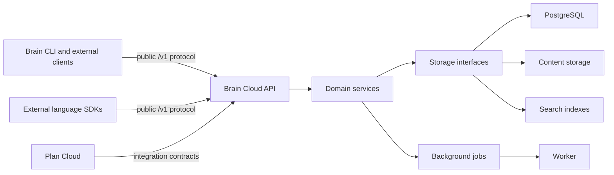

# Architecture

## System context

## Boundaries and modules

`cmd/api` and `cmd/worker` are composition roots. `internal/config` owns environment configuration and `internal/server` owns HTTP transport. Future domain modules remain separated by responsibility: platform identity and tenancy; projects; memory and context; search; sync; Hive Mind; agents and proposals; audit; and storage adapters. Packages appear only when a working feature needs them.

Brain Cloud implements the protocol and never imports its client SDKs. Generated protocol models and low-level transport belong in external language repositories, with handwritten ergonomic clients layered above them. The Brain CLI consumes `brain-cloud-sdk-go` and retains all local Markdown and `.brain/` behavior. Plan Cloud consumes explicit context, Hive, reference, contradiction, and proposal contracts but keeps planning domain models separate.

## API-first protocol

All product APIs are base-URL configurable and versioned below `/v1`. `/v1/system/info` exposes server identity, protocol version, and capabilities for compatibility negotiation. The OpenAPI contract grows with implemented behavior and is intended to generate Go, TypeScript, and Python protocol layers. Unimplemented top-level areas are reserved but have no invented schemas.

## Persistence and revisions

Storage is hidden behind domain-oriented interfaces. PostgreSQL is the likely transaction and metadata store; object or filesystem storage may hold large durable content; search and vector indexes remain derived state. Provider-specific managed services must not leak into domain contracts.

Durable documents have stable IDs and immutable revisions with parent revision, content hash, actor identity, timestamp, summary, provenance, and deletion/conflict history. Restore creates a new revision. Indexes and local SQLite databases are never synchronization payloads.

## Authorization, retrieval, and indexing

Authentication resolves an actor; authorization resolves permitted operations and project/content visibility. Filtering happens before indexing selection, retrieval, context compilation, reranking, or model calls. Search executes within authorized project boundaries. Hive Mind retrieves per project, reranks across those results, and preserves source project and revision provenance rather than flattening all tenants into one global pool.

## Context and background work

Context compilation accepts a task, scope, token budget, categories, freshness, sources, and output format. It returns bounded selections, revisions, provenance, rationale, contradictions, and missing-information warnings.

Workers eventually process indexing, imports, exports, contradiction discovery, and events through idempotent, retry-safe jobs. Phase 0 provides only a lifecycle-ready worker process; no queue is selected until a feature needs it.

## Synchronization

Hybrid sync exchanges durable content and metadata using stable document IDs, immutable revisions, cursors, hashes, and idempotency keys. Push, pull, offline edits, renames, deletions, interruption, and retries are explicit protocol concerns. Divergent durable edits create conflict records; neither side is silently overwritten. Selective visibility policy controls what may leave a device.

## Deployment model

One server codebase supports localhost, Docker Compose, single-server self-hosting, scalable multi-service deployments, and the official hosted service. Environment variables configure external dependencies and base behavior. Phase 0 Compose includes API and PostgreSQL only. Production packaging will later add migrations, backups, observability, worker deployment, upgrades, and operational guidance.

## Future decisions

Frontend framework, production queue, object storage, search engine, vector retrieval, authentication providers, and encryption implementation remain undecided until their phases supply concrete requirements.
