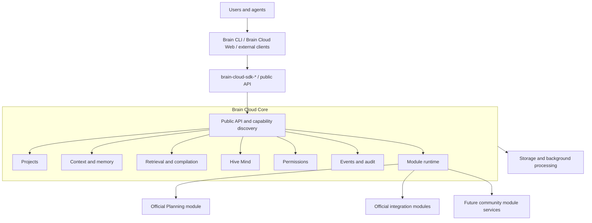

# Architecture

## System context



## Core boundary

Brain Core supplies invariants every module needs: project identity, durable context and memory, retrieval, compilation, provenance, sessions, configuration, authentication boundaries, permissions, events, audit, module lifecycle, and capability registration. Brain Cloud supplies their cloud implementations plus organizations, collaboration, conversations, revisions, sync, Hive Mind, agents, workers, module management, and deployment.

Hive Mind stays core. Modules contribute bounded sources and tools through mediated contracts, while Hive Mind retains scope resolution, authorized project selection, per-project retrieval, cross-project reranking, relationship/contradiction analysis, compilation, and attribution.

## Module boundary

Planning is the first major official module. It remains optional, uses formal module interfaces, has planning-specific permissions, and receives no private access to unrelated Brain internals. Its cloud data is hosted by Brain Cloud only when enabled. The current standalone `plan` repository is transitional; no Plan Cloud service is part of the target architecture.

Expected official modules may cover Planning, Git/GitHub, agent access, notifications, secrets/redaction, import/export, and selected adapters. Community modules may provide additional context, search, memory types, tools, jobs, UI, approvals, or integrations. Expected does not mean committed for the first release.

## Staged runtime model

### Stage 1: supervised official modules

Official cloud modules initially live as supervised Elixir/OTP applications inside the Brain Cloud umbrella. Each implements explicit behaviours, registers capabilities, declares permissions, is explicitly enabled, and avoids coupling to unrelated internals. Planning begins here so real use can validate the contracts. Local Brain may use equivalent native contracts in its own runtime; the public module contract does not depend on a shared language ABI.

### Stage 2: external process modules

Community modules eventually run as separate processes rather than sharing the server VM. Connect RPC, gRPC, and JSON-RPC are candidates; no transport is selected yet. The process model provides language independence, isolation, independent releases, crash containment, and explicit permission mediation.

### Stage 3: cloud services and UI extensions

Brain Cloud may later host module services and workers, route module APIs, deliver events, expose module-defined agent tools, and render constrained navigation, settings, panels, and dashboards. Web extension sandboxing and trust require a separate design.

## Candidate extension points

Contracts remain provisional until official modules validate them:

- CLI command groups such as `brain plan ...` or `brain github ...`;
- bounded, permission-aware context providers;
- searchable records with provenance and visibility;
- structured memory types;
- typed agent tools;
- event subscriptions;
- idempotent background jobs;
- controlled versioned API registration;
- constrained trusted web surfaces;
- integration providers that do not become mandatory sources of truth.

Events may include project creation, context updates, memory revisions, sync completion, contradictions, planning approval, and pull-request merge.

## Conceptual manifest

```yaml
id: official.planning
name: Brain Planning
version: 0.1.0
brain_api: ">=1.0 <2.0"

runtime:
  local: true
  cloud: true
  web: true

capabilities:
  - commands
  - context_provider
  - search_provider
  - event_consumer
  - agent_tools
  - web_routes

permissions:
  - project.context.read
  - project.memory.propose
  - planning.read
  - planning.write
  - planning.approve
```

The final manifest may also declare optional dependencies, configuration schema, data migrations, network access, secret access, provenance, publisher identity, and signatures or checksums. This is direction, not an implemented schema.

## Capability and API discovery

All product APIs remain configurable by base URL and versioned below `/v1`. `/v1/system/info` reports protocol compatibility, core capabilities, and enabled module IDs. An empty module list and absent `planning` capability are valid.

Future reserved areas include `/v1/modules`, `/v1/modules/{module_id}`, `/v1/modules/{module_id}/config`, and `/v1/planning`. Detailed Planning schemas wait for the dedicated module contract. Trusted modules register routes only through controlled routing and capability discovery.

`brain-cloud-sdk-go` exposes core clients and capability-gated optional clients, conceptually `Projects`, `Context`, `Memory`, `Search`, `Hive`, `Modules`, and `Planning`. SDKs contain transport/client logic, not local filesystem behavior or module implementations.

## Permissions and security

Core mediates every module capability. Planning read/write/approve permissions remain distinct from context read, memory propose, or memory edit. Module installation requires explicit approval; organizations can restrict publishers and versions. Network, filesystem, secret, and event access must be declared and audited.

In-process official modules are trusted code but still respect declared boundaries. External modules gain process isolation where practical. Brain does not claim full sandboxing. Failure must degrade the module safely without corrupting core data or bypassing authorization.

## Data ownership and storage

Core and modules have explicit storage ownership. Module migrations run through controlled lifecycle hooks; modules cannot mutate unrelated schemas. Module records retain project/tenant scope, revision and audit data, and export behavior.

PostgreSQL remains the likely transactional store; filesystem/object storage may hold large durable content; search indexes remain derived. Workers run retryable, idempotent core and module jobs. Storage/search providers stay behind interfaces and avoid managed-cloud lock-in.

## Local, cloud, and hybrid behavior

Local Brain loads enabled official modules through stable local contracts. Brain Cloud supervises enabled official OTP applications and manages cloud module configuration. Hybrid synchronization includes module data only when its module defines compatible identity, revision, visibility, conflict, and export semantics.

Planning must work without GitHub or another tracker. GitHub can remain a transitional import, publication, mirror, or execution target and later an optional module. No official Linear integration is planned.

## Unified frontend

One Brain Cloud web application owns core navigation: projects, context, memory, search, conversations, Hive Mind, revisions, proposals, teams, agents, modules, and administration. Enabled trusted modules may contribute constrained surfaces. Planning surfaces appear only when the Planning module is enabled.

## Deployment

The same server supports localhost, Docker Compose, single-server self-hosting, scalable multi-service deployments, and the official hosted service. Self-hosters control enabled modules and policy. Production module execution, signing, updates, isolation, and diagnostics arrive only through staged roadmap work.

## Current implementation

Phase 0 is a Phoenix umbrella. `apps/brain_cloud` owns Ecto/PostgreSQL, compatibility metadata, readiness, release migrations, and domain supervision. `apps/brain_cloud_web` owns Phoenix, Bandit, LiveView, JSON transport, and the minimal web shell. OTP handles graceful supervision; no separate worker application exists until real jobs require one. No module registry, Planning domain, arbitrary loading, or external process protocol exists yet.
